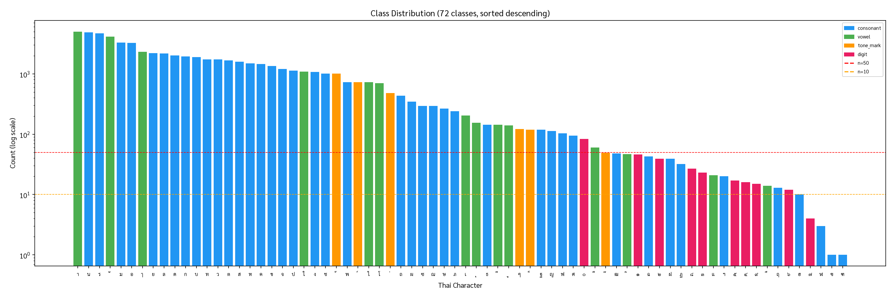
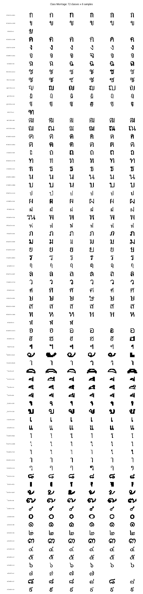
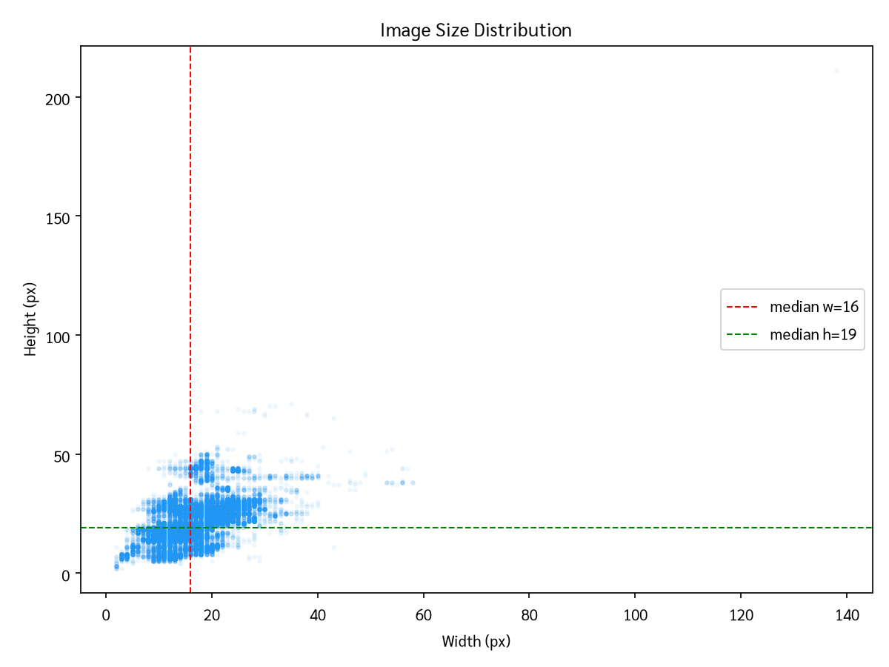
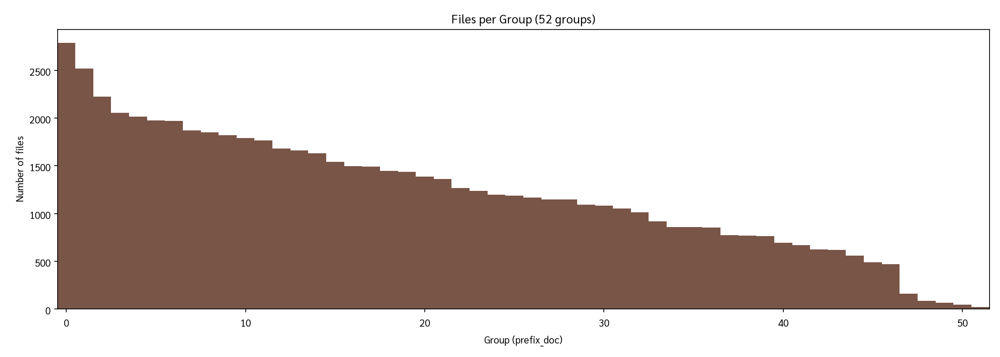

# รายงาน EDA — ชุดข้อมูลตัวอักษร/ตัวเลขไทย 72 คลาส

วันที่ 2026-09-19 · ข้อมูลดิบ `ThaiCharacter Dataset/round2/` · ตัวเลขทั้งหมดคำนวณโดย `scripts/eda.py`
(ผลดิบ: `reports/eda/EDA.md`, `class_stats.csv`, `files.csv`, `summary.json`, `duplicates.json`)
ตัวเลขทุกตัวถูก reproduce อิสระและ **ตรงกับ EDA ของโปรเจกต์เก่า (`../CNN/reports/dataset_summary.md`) ทุกหลัก**

## 1. ความครบถ้วนของข้อมูล (ตามข้อควรระวังเรื่องการแตกไฟล์)

| รายการ | ค่า |
|---|---|
| ไฟล์ `.jpg` ทั้งหมด (ไม่รวม `__MACOSX/`) | **62,707** |
| เปิด/decode ได้ | **62,707 (100%)** — corrupted = 0 |
| ไฟล์ที่ไม่ใช่ภาพ (ข้าม) | `.DS_Store` ×2, `Thumbs.db` ×2 |
| จำนวนโฟลเดอร์คลาส | **72** (ตรงโจทย์) |
| เทียบกับสำเนาเก่าใน `../CNN/` | รายชื่อไฟล์ **เหมือนกัน 100%** (diff ว่าง) |

→ ข้อมูลครบ ไม่มีร่องรอยไฟล์หายจากการแตก zip

### ชื่อโฟลเดอร์คือรหัส TIS-620
`ตัวอักษร = chr(0x0E00 + code − 0xA0)` เช่น 161→ก, 210→า, 240→๐ … 249→๙ ยืนยันด้วยลำดับความถี่
า > น > ร > ั > ม > อ ซึ่งเป็นลำดับความถี่จริงของภาษาไทยเขียน (offset ผิดจะไม่ได้ลำดับนี้)

| หมวด | คลาส | ภาพ | สัดส่วน |
|---|---:|---:|---:|
| พยัญชนะ (ก…ฮ, ฯ) | 42 | 45,177 | 72.0% |
| สระ (ั า ิ ี ึ ื ุ ู เ แ โ ใ ไ ๅ) | 14 | 14,747 | 23.5% |
| วรรณยุกต์/เครื่องหมาย (ๆ ็ ่ ้ ๊ ์) | 6 | 2,501 | 4.0% |
| **เลขไทย ๐–๙** | **10** | **282** | **0.45%** |

รหัสที่ **ไม่มี** ในชุดข้อมูล: ฅ ฆ ฌ ฎ ฦ ะ ำ ๋ ํ (ตัวที่หายเป็นตัวที่พบน้อยในข้อความจริง)

ตารางจำนวนภาพครบ 72 คลาส (code, char, n, %, ขนาดกลาง, จำนวนเอกสารต้นทาง, train/val ที่ 80:20) อยู่ที่
`reports/eda/EDA.md` §Full 72-Class Table — ไม่คัดลอกซ้ำที่นี่

## 2. Class imbalance — รุนแรงและ "มีโครงสร้าง"

| | |
|---|---|
| คลาสใหญ่สุด / เล็กสุด | **า 5,025** / **ฃ 1, ฑ 1** → อัตราส่วน **5,025 : 1** |
| Gini ของขนาดคลาส | 0.672 |
| top-10 คลาส | 54.2% ของภาพทั้งหมด |
| คลาสที่ n < 50 | **23** คลาส · n < 10: 4 คลาส (ฮ 10, ๗ 4, ฬ 3, ฃ 1, ฑ 1) |

หาง (tail) ไม่ได้สุ่ม: **เลขไทยทั้ง 10 ตัวเป็น minority** (๐ 83 → ๗ 4) เพราะเอกสารพิมพ์ใช้เลขอารบิก
ที่เหลือคือพยัญชนะหายาก (ฃ ฑ ฬ ฤ ฮ ฯ ฏ) และสระ/วรรณยุกต์บางตัว (ึ 14, แ 21, ิ 47, ๊ 49)

นัยต่อการวัดผล: โมเดลที่ทำนายแต่ 10 คลาสใหญ่ก็ได้ accuracy 54% แล้ว → ทุกการทดลองต้องรายงาน
**balanced accuracy + macro-F1 + accuracy ของกลุ่ม n<50** ควบกับ top-1 เสมอ
นัยต่อ split: 80:20 แบบ stratified ทำให้ ฃ และ ฑ **ไม่มีตัวอย่าง validation เลย** (n=1) — ต้องมีกติกาชัด
และ synthetic data จากฟอนต์เป็นทางเดียวที่ทำให้ 2 คลาสนี้ "เรียนได้" จริง

## 3. ลักษณะภาพ — เล็กมาก, ไบนารีแท้, ครอปชิดหมึก

| สถิติ | ค่า |
|---|---|
| ขนาดกลาง (median) | **16 × 19 px** (พื้นที่กลาง 306 px) |
| ความกว้าง p1/p25/p50/p75/p99 | 6 / 13 / 16 / 19 / 29 (max 138) |
| ความสูง p1/p25/p50/p75/p99 | 7 / 17 / 19 / 27 / 44 (max 211) |
| ระดับเทาช่วง 32–223 | **0.000%** ของพิกเซล → ภาพเป็น 1-bit (ดำ/ขาว) ที่เก็บเป็น JPEG |
| สัดส่วนหมึก (px<128) เฉลี่ย | 0.435 |
| ความสว่างเฉลี่ยของขอบ 1 px | 165/255 → ครอปชิดกล่องหมึก **ไม่มี margin** |

ผลต่อการออกแบบ:
1. **ข้อมูลจริงมีรายละเอียดไม่เกิน ~44 px** — การ upsample ไป 224 px ไม่ได้เพิ่มข้อมูล แต่ทำให้ฟิลเตอร์
   ImageNet ทำงานที่สเกลที่มันถูกฝึกมา → ต้องเทียบ input 32/64/96/128/224 จริง ๆ (accuracy vs เวลา)
2. **ห้าม stretch ให้เป็นสี่เหลี่ยมจัตุรัส** — อัตราส่วนภาพเป็นสัญญาณจำแนก: า 12×20, ๅ 13×27, ั 14×8, ่ 4×8
   คู่ **า/ๅ ต่างกันแค่ความสูง** (median 20 vs 27) และเป็นคู่สับสนอันดับ 1 ของโมเดลเก่า → ใช้ pad-to-square
   แบบคงอัตราส่วน + เก็บ `(log w, log h, log w/h, ink%)` เป็น side-channel ให้หัวจำแนก
3. ต้องเติม margin ~10% เพราะครอปชิดหมึก ปลายเส้นอยู่ที่ขอบพอดี
4. Augmentation ที่ตรงโดเมนที่สุดคือ **morphological dilate/erode** (ความหนาเส้น) + resolution jitter
   (DPI ต่างกัน) + speckle; **ห้าม flip** ทุกแกน

## 4. สุขอนามัยข้อมูล (data hygiene)

| ปัญหา | จำนวน | นโยบาย (TASK-02) |
|---|---:|---|
| ภาพซ้ำแบบ byte-identical (MD5) | 1,174 กลุ่ม → **2,579 ไฟล์ซ้ำ (4.1%)** | ลบก่อน split (กันรั่ว train→val) |
| **ภาพเดียวกันแต่อยู่ 2 คลาส** | **11 กลุ่ม** | ลบทุกสำเนา (label ไม่รู้ว่าอันไหนถูก) |
| ไฟล์ `Copy of *.jpg` | 6 | ลบ — 5 ใน 6 เป็นภาพ จ (168) ที่ถูกวางไว้ในโฟลเดอร์ า (210) |
| เหลือหลังทำความสะอาด | **≈ 60,1xx** ภาพ | (ตัวเลขแม่นยำจาก TASK-02) |

ตัวอย่างการชนข้ามคลาสที่บอกอะไรเรา: `210/ce_001sg_2_8.jpg == 229/ce_001sg_2_8.jpg` (า vs ๅ) —
**แม้ผู้ทำ label ก็แยก า/ๅ ไม่ได้ในบางภาพ** จึงเป็น noise ceiling ของคู่นี้; `164 ค == 181 ต`, `185 น == 186 บ`,
`193 ม == 209 ั` เป็นคู่ที่รูปร่างคล้ายกันจริงในฟอนต์นี้

## 5. โครงสร้างกลุ่มแฝง — ที่มาของภาพ (ความเสี่ยง leakage และ generalisation)

ชื่อไฟล์ `{be,bc,bl,ce}_<เอกสาร 3 หลัก><sg|tg>_<บรรทัด>_<ลำดับ>.jpg`

| ฟิลด์ | ค่า |
|---|---|
| prefix | be 32,656 · bc 21,571 · bl 8,317 · ce 163 |
| เอกสาร | 20 รหัส → **52 กลุ่ม (prefix, เอกสาร)** |
| subset | sg 32,145 · tg 30,562 |
| คลาสที่มาจากเอกสาร ≤ 3 ฉบับ | ฃ ฑ ฬ (1), เ (2), ฤ ๗ (3) |

ภาพจากเอกสารเดียวกันใช้ฟอนต์/DPI/threshold เดียวกัน → split แบบ stratified สุ่ม (ที่โจทย์บังคับ) วัด
"การรู้จำภายในเอกสารที่เคยเห็น" ซึ่งมองโลกในแง่ดีเกินจริงถ้า **hidden test set ของอาจารย์มาจากเอกสารชุดใหม่**
เราจึงจะรายงาน 2 split ควบกัน: (1) stratified 80:20 seed 42 = ตัวหลักตามโจทย์, (2) document-disjoint
(กันเอกสาร 4 ฉบับไว้) = ตัวตรวจ generalisation; โมเดลเก่าเคยวัดช่องว่างนี้ได้ −2.5 ถึง −4.5 จุด balanced acc

## 6. ความท้าทายที่สรุปได้ (สำหรับสไลด์)
1. imbalance 5,025:1 และหางที่เป็นเลขไทยทั้งหมด → ต้องใช้ synthetic font data + loss/sampler ที่ถูกจูน
2. ภาพเล็ก 16×19 px ไบนารี → transfer จาก ImageNet ไม่ตรงโดเมน ต้องพิสูจน์ด้วยการทดลองว่า input size /
   ระดับการ fine-tune ไหนคุ้ม และเพิ่ม "โดเมนตรง" ด้วย synthetic pretraining
3. คู่ตัวอักษรคล้าย (า/ๅ, ค/ด/ต, ช/ซ, ข/บ, ั/้, ฟ/ป, ท/พ) — บางคู่ต่างกันที่ขนาดสัมบูรณ์ ไม่ใช่รูปร่าง
4. duplicates 4.1% + label ชนกัน 11 กลุ่ม → ต้อง dedup ก่อน split ไม่งั้นคะแนน validation เฟ้อ
5. โครงสร้างเอกสาร 52 กลุ่ม → ต้องมี split สำรองแบบ document-disjoint เพื่อไม่หลอกตัวเอง

## 7. Baseline ที่ต้องเอาชนะ
โปรเจกต์เก่าของเจ้าของงาน (`../CNN`, Rust CNN 138k พารามิเตอร์, ไม่ใช้ ImageNet):
**top-1 96.7% · balanced acc 96.6% · macro-F1 0.965** บน stratified val (12,028 ภาพ) หลัง logit adjustment
τ=0.25 — ตัวเลขนี้คือเส้นฐานที่ transfer learning + augmentation ของงานใหม่ต้องทำให้ดีกว่า
