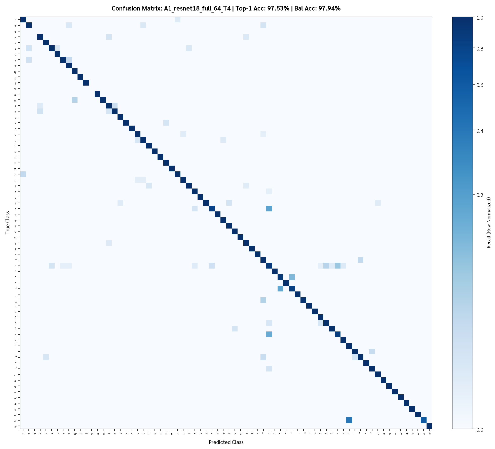

# บันทึกผลการทดลอง (อัปเดตต่อเนื่อง)

Protocol: หลัง dedup 60,117 ภาพ · split stratified 80:20 seed 42 (train 48,090 / val 12,027, 70 คลาสใน val) ·
metric บน val เต็ม: top-1, **balanced acc** (mean recall ต่อคลาส), macro-F1, minority acc (recall ของคลาสที่ train n<50) ·
checkpoint เลือกด้วย balanced acc (caveat: เลือกบน val เดียวกับที่รายงาน) · เครื่อง: Colab **T4** ผ่าน `colab` CLI ·
ตารางรวมอัตโนมัติ: `reports/experiments.md` (สร้างจาก `runs/*/metrics.json` ด้วย `scripts/collect_results.py`)

## A. Transfer learning baseline — 64 px, aug=base, CE+LS 0.1, AdamW cosine, EMA, 6 epochs, train เต็ม

| exp | โมเดล | pretrained | mode | top-1 | balanced | macro-F1 | minority | s/epoch (T4) |
|---|---|---|---|---:|---:|---:|---:|---:|
| A3 | efficientnet_b0 | ImageNet | **full** | **0.9769** | **0.9809** | **0.9786** | 0.9667 | ~45 |
| A1 | resnet18 | ImageNet | **full** | 0.9753 | 0.9794 | 0.9770 | 0.9667 | 28 |
| A2 | mobilenetv3_large_100 | ImageNet | **full** | 0.9759 | 0.9775 | 0.9568 | 0.9583 | 42 |
| A0 | SmallCNN (scratch 0.43M) | – | – | 0.9742 | 0.9189 | 0.9214 | 0.8917 | 24 |
| A1 | resnet18 | ImageNet | partial (35% ท้าย) | 0.9622 | 0.9067 | 0.9075 | 0.8750 | 26 |
| A2 | mobilenetv3 | ImageNet | partial | 0.9317 | 0.8712 | 0.8586 | 0.8333 | 36 |
| A2 | mobilenetv3 | ImageNet | frozen | 0.9178 | 0.7810 | 0.8035 | 0.6333 | 36 |
| A1 | resnet18 | ImageNet | frozen | 0.8567 | 0.5633 | 0.5916 | 0.2167 | 24 |

ข้อสรุป A:
1. **Fine-tune ทั้งตัวเท่านั้นที่คุ้ม** — frozen backbone (linear probe) ได้ balanced acc แค่ 56–78% แสดงว่าฟิลเตอร์
   ImageNet ดิบ ๆ ไม่เข้ากับภาพไบนารีเล็ก; partial ดีขึ้นแต่ยังแพ้ scratch ในแง่ top-1
2. แต่ **ImageNet init ยังมีค่า**: full fine-tune ชนะ scratch ที่งบเท่ากัน +6 จุด balanced acc (97.9 vs 91.9) และ
   +7.5 จุดบน minority — pretrained weights ช่วยคลาสหางที่มีตัวอย่างน้อยเป็นพิเศษ
3. top-1 ของ 3 backbone ต่างกันแค่ 0.16 จุด (97.5–97.7) — ใกล้เพดานที่ label noise ของคู่ า/ๅ กำหนด;
   ความต่างอยู่ที่ balanced acc / macro-F1 → efficientnet_b0 ≳ resnet18 > mnv3
4. ทั้ง 3 ตัวชนะ baseline เก่าของโปรเจกต์ (ThaiGlyphNet Rust, 96.7 / 96.6) ตั้งแต่ 6 epochs แรก
5. logit adjustment τ: ช่วย A0/partial/frozen มาก (เช่น A0 91.9→96.6) แต่กับ full fine-tune แทบไม่ช่วย (τ=0–0.25 ดีสุด)
   → โมเดลที่เทรนดีอยู่แล้วไม่ต้องแก้ prior หลังบ้าน

ตัดสินใจ: ใช้ **resnet18 full** เป็นแกนของ matrix B/D/E (เร็วสุดต่อ epoch, ผลใกล้ effb0) แล้วค่อยย้าย recipe ที่ชนะไป
effb0 / convnext / ViT ในขั้น S (input size) และการเทรนตัวจริง

## Error analysis ของ A1 (resnet18 full @64) — `reports/analysis/A1_resnet18_full_64_T4/`

| อันดับ | คู่ที่สับสน | จำนวนผิด (val) | ลักษณะ |
|---:|---|---:|---|
| 1 | **า ↔ ๅ** | 95 (57+38) | รูปร่างเดียวกัน ต่างแค่ความสูง (20 vs 27 px) — และมี label ชนกันในข้อมูลจริง → noise ceiling |
| 2 | **ว → า** | 59 (17.6% ของ ว!) | ห่วงบนของ ว หายจากการ binarize จนเหลือแค่ตะขอ = า |
| 3 | า → ใ | 28 | เส้นสูงมีห่วง |
| 4 | ั ↔ ้ | 19 | วรรณยุกต์เล็กเหนือบรรทัด ต่างที่หางเล็ก ๆ |
| 5 | ด ↔ ต | 7 | ต่างที่รอยบากบนหัว |
| 6 | ี ↔ ื | 5 | ต่างที่ขีดกลางเส้นเดียว (ื n_train=48) |
| 7 | ช → ซ | 4 | หัวหยัก |

คลาส recall ต่ำสุด: ๘ 60% (n_val=5, สับสนกับ ็), ว 81.9%, ื 83.3%, ๅ 85.4%, า 87.8%
→ **ความผิดพลาดกว่า 70% มาจากกลุ่ม า/ๅ/ว/ใ** ซึ่งเป็นเรื่องความสูงสัมบูรณ์และห่วงที่หายไป ไม่ใช่รูปร่าง
แนวแก้เฉพาะจุดที่จะทดลอง: geometry side-channel (E5: ให้โมเดลรู้ w,h จริง), ON/OFF channels (E6), pairwise
re-scoring า/ๅ ด้วยความสูง, และเช็คว่า TTA ช่วย ว หรือไม่

## B. Data augmentation — resnet18 full @64, CE+LS 0.1, 6 epochs, train เต็ม, stratified val

| exp | aug | synthetic | top-1 | balanced | macro-F1 | minority | best ep |
|---|---|---|---:|---:|---:|---:|---:|
| B_none | **ไม่มี** | – | **0.9848** | 0.9815 | **0.9816** | 0.9667 | 6 |
| B_randaug | RandAugment (N=2, ไม่มี flip) | – | 0.9821 | 0.9825 | 0.9805 | 0.9667 | 6 |
| B_trivial | TrivialAugment | – | 0.9805 | **0.9827** | 0.9793 | 0.9667 | 3 |
| B6_synth_all | full + synthetic 21.6k (ทุกคลาส) | ✓ | 0.9769 | 0.9804 | 0.9743 | n/a* | 6 |
| B6_synth_fill | full + synthetic เติมคลาสเล็กถึง 300 | ✓ | 0.9769 | 0.9799 | 0.9718 | n/a* | 6 |
| B_base (=A1) | affine + margin | – | 0.9753 | 0.9794 | 0.9770 | 0.9667 | 6 |
| B_morph | base + dilate/erode + res-jitter | – | 0.9785 | 0.9694 | 0.9662 | 0.9583 | 5 |
| B_full | morph + elastic/noise/blur/erase | – | 0.9780 | 0.9644 | 0.9617 | 0.9583 | 6 |
| B_full_mixup | full + Mixup α=0.2 | – | 0.9761 | 0.9492 | 0.9493 | 0.9083 | 6 |
| B_full_cutmix | full + CutMix | – | 0.9734 | 0.9403 | 0.9385 | 0.9083 | 5 |
\*minority_acc ของ B6 เป็น NaN เพราะ bug นับ synthetic รวมใน n_train (แก้แล้วในรอบถัดไป)

ข้อสรุป B (บน stratified val = in-distribution):
1. **ที่งบ 6 epochs augmentation หนักทำให้แย่ลง** — ลำดับชัด: none > randaug ≈ trivial > base > morph > full > mixup/cutmix
   ตีความ: val มาจากเอกสารชุดเดียวกับ train (ฟอนต์/DPI เดิม) จึงไม่ต้องการความทนทาน และ aug หนักต้องใช้ epoch มากกว่านี้
2. **Mixup/CutMix ไม่เหมาะกับกลิฟไบนารี** — ภาพผสมเป็นเงาเทาที่ไม่มีใน test, balanced acc ร่วง 3–4 จุด (ยืนยันสมมติฐาน)
   แต่ post-hoc τ=0.75 ดึงกลับได้ถึง 98.03 → mixup เปลี่ยน prior ของโมเดล มากกว่าทำลาย feature
3. **Synthetic data ช่วยเมื่อ aug หนัก**: full aug อย่างเดียว 96.44 → full + synthetic 98.04 balanced (+1.6 จุด)
   และ synthetic ทำให้ ฃ/ฑ (n=1) มีตัวอย่างฝึกจริง ๆ
4. RandAugment/TrivialAugment (แบบ 1–2 op ต่อภาพ) เป็นจุดสมดุลที่ดี: เสีย top-1 เล็กน้อยแต่ balanced acc สูงสุด
5. **คำเตือน**: ตารางนี้วัด in-distribution เท่านั้น — การตัดสินใจเรื่อง aug สำหรับ hidden test ที่ "เน้น generalize" ต้องดู
   doc-disjoint split (คิวถัดไป) และ robustness curve: โมเดล base-aug พังบนภาพเทา/เส้นบางใน TASK-11 (Otsu ที่ inference แก้เรื่องเทาได้)

## D. Class imbalance — resnet18 full @64, aug=full (ฐานเดียวกับ B_full/D0), 6 epochs, stratified val

| exp | วิธี | top-1 | balanced | macro-F1 | minority | τ ดีสุด (bal) |
|---|---|---:|---:|---:|---:|---:|
| D0 | CE + LS 0.1 (ERM) | **0.9780** | 0.9644 | 0.9617 | 0.9583 | τ=0.75 → 0.9806 |
| D1 | weighted CE, w ∝ n^-0.5 | 0.9727 | **0.9840** | 0.9713 | **0.9750** | τ=0 |
| D1 | weighted CE, w ∝ n^-1 | **0.1160** | 0.6041 | 0.6010 | 0.9583 | – |
| D2 | focal γ=2 | 0.9778 | 0.9695 | 0.9645 | 0.9667 | τ=0.5 → 0.9832 |
| D2 | class-balanced focal β=0.999 | 0.9672 | 0.9751 | 0.9538 | 0.9750 | τ=0 |
| D3 | WeightedRandomSampler sqrt-inv, cap 5 | 0.9721 | 0.9837 | **0.9768** | 0.9750 | τ=0 |
| D3 | WeightedRandomSampler inv, cap 10 | 0.9694 | 0.9841 | 0.9721 | 0.9750 | τ=0 |
| D4 | post-hoc logit adjustment บน D0 | (τ=0.75) 0.9718* | 0.9806 | – | – | ฟรี |

ข้อสรุป D:
1. **การชดเชย imbalance ทุกแบบแลก top-1 กับ balanced acc**: +2 จุด balanced ↔ −0.5 ถึง −0.9 จุด top-1
   เพราะคลาสหาง (เลขไทย, ฃ ฑ ฬ) ถูกทายบ่อยขึ้นและกินคลาสใหญ่ (า/ๅ/ว) ไปบ้าง
2. **inverse-frequency เต็ม ๆ พังทั้งระบบ** (top-1 11.6%) — น้ำหนักต่างกัน 5,025 เท่า → โมเดลทายคลาสหายากทุกภาพ
   ต้องใช้ sqrt หรือ cap เสมอ (ยืนยันข้อค้นพบของโปรเจกต์เก่า)
3. sqrt-inverse **weighted loss ≈ sqrt-inverse sampler** (98.40 vs 98.37 balanced) → เลือกวิธีไหนก็ได้ sampler ให้ macro-F1 ดีกว่าเล็กน้อย
4. **logit adjustment หลังบ้านบน ERM ให้ผลใกล้กัน (98.06) โดยไม่ต้องเทรนใหม่** และปรับ τ ได้ตาม metric ที่อาจารย์ใช้
   (ถ้าคะแนนคือ plain accuracy บน test → ใช้ ERM/τ=0; ถ้าเป็น balanced → τ≈0.5–0.75)
5. **synthetic data (B6) ให้ balanced 98.04 โดยไม่เสีย top-1** (97.69) → เป็นวิธีจัดการ imbalance ที่ "ฟรี" ที่สุด
   และเป็นทางเดียวที่ทำให้ ฃ/ฑ เรียนได้จริง

*ค่า top-1 ที่ τ=0.75 ประมาณจาก tau sweep ของ D0 (`runs/D0_ce_ls_resnet18_64_T4/metrics.json`)

## E. เทคนิคเสริม — resnet18 full @64, aug=full (ฐาน D0 = 97.80 / 96.44), 6 epochs, stratified val

| exp | เทคนิค | top-1 | balanced | macro-F1 | minority | หมายเหตุ |
|---|---|---:|---:|---:|---:|---|
| D0 | ฐาน (EMA on) | 0.9780 | 0.9644 | 0.9617 | 0.9583 | |
| E1_noema | ปิด EMA | 0.9780 | 0.9636 | 0.9609 | 0.9500 | EMA แทบไม่มีผลที่ 6 epochs |
| E1_llrd | layer-wise LR decay 0.8 | 0.9762 | 0.9557 | 0.9542 | 0.9167 | **แย่ลง** — ชั้นต้นของ ImageNet ต้องปรับตัวมาก (สอดคล้อง frozen/partial แพ้) |
| E5_geometry | geometry side-channel [log w, log h, log w/h, ink%] | 0.9775 | **0.9690** | 0.9655 | 0.9667 | +0.5 balanced, top-1 เท่าเดิม |
| E6_onoff | 3-channel ON/OFF (ink / distance-transform / edges) | 0.9756 | 0.9620 | 0.9609 | 0.9500 | ไม่ช่วย (−0.2) บน in-distribution val |
| E6_onoff+geo | ทั้งสองอย่าง | 0.9775 | 0.9626 | 0.9615 | 0.9500 | |
| E3 ensemble | soft-vote resnet18+effb0+smallcnn (A) | 0.9778 | 0.9815 | 0.9790 | 0.9667 | +0.1–0.25 เหนือตัวเดี่ยวที่ดีสุด — โมเดลผิดที่จุดเดียวกัน (า/ๅ) |
| E4 logit-adj | τ sweep บนทุกตัว | | | | | ช่วย 0.5–2 จุด balanced เมื่อโมเดลยังไม่ balanced; ไม่ช่วยตัวที่ดีอยู่แล้ว |

ข้อสรุป E: เทคนิค "ฟรี" ที่คุ้มคือ geometry side-channel และ logit adjustment; ensemble ให้กำไรน้อยเพราะ error ไม่อิสระ;
ON/OFF encoding ที่ได้แรงบันดาลใจจาก fly visual system ไม่ช่วยในเงื่อนไขนี้ — จะทดสอบซ้ำบน doc-disjoint (ที่ต้องการความทนทานมากกว่า) ก่อนตัดสิน

## C. Transfer source อื่นนอกจาก ImageNet (stage-1 → zero-shot บน val จริง)

| stage-1 | ข้อมูล | epochs | top-1 บน val จริง (ไม่เคยเห็นข้อมูลจริง) | balanced | minority |
|---|---|---:|---:|---:|---:|
| B6a_synth_pretrain | ImageNet → **ฟอนต์สังเคราะห์ 21,600 ภาพ / 26 ฟอนต์** | 8 | **0.9369** | 0.9188 | 0.9083 |
| C1_ext_pretrain | ImageNet → **ลายมือ public 100,985 ภาพ** (ALICE-THI + Burapha-TH) | 4 | 0.9148 | 0.9112 | 0.9500 |

ข้อค้นพบ: โมเดลที่เห็นแต่ตัวอักษรที่ render จากฟอนต์ (พร้อม degradation) รู้จำกลิฟสแกนจริงได้ **93.7%** โดยไม่เห็นข้อมูล
ของอาจารย์เลย → synthetic pipeline ของเราใกล้โดเมนจริงมาก และเป็นหลักฐานว่าวิธีนี้จะช่วย generalisation ไปฟอนต์ใหม่
ส่วนลายมือ public ต่างโดเมน (ลายมือ vs ตัวพิมพ์) แต่ยัง zero-shot ได้ 91.5% และช่วยคลาสหางเป็นพิเศษ (minority 95.0%)
ผล stage-2 (fine-tune ต่อบนข้อมูลจริง) อยู่ในตารางถัดไปเมื่อรันเสร็จ

## S. Input size — resnet18 full, aug=full, 6 epochs, stratified val (T4)

| size | top-1 | balanced | macro-F1 | s/epoch (T4) | latency bs=1 CPU (ms) |
|---:|---:|---:|---:|---:|---:|
| 32 | 0.9752 | 0.9588 | 0.9506 | 29.5 | 9.0 |
| **64** | 0.9780 | 0.9644 | 0.9617 | 28.2 | 12.1 |
| 96 | 0.9768 | 0.9587 | 0.9582 | 41.5 | 17.0 |
| 128 | 0.9785 | 0.9568 | 0.9568 | 52.1 | ~25 |
| 224 | 0.9776 | 0.9673 | 0.9635 | 116.5 | 71.2 |

ข้อสรุป S: **64 px คือจุดคุ้มที่สุด** — ใหญ่กว่านั้นไม่เพิ่มข้อมูล (กลิฟจริง ≤ 44 px, median 16×19) แต่เวลา/epoch เพิ่ม 4× และ latency 6×
ที่ 224 px (ขนาดที่ ImageNet ถูกฝึก) ได้ balanced ดีขึ้นเล็กน้อย (+0.3) ไม่คุ้มต้นทุน; 32 px เริ่มเสียรายละเอียดของวรรณยุกต์เล็ก ๆ

## G. Stratified vs Document-disjoint — ตัวตัดสินสำหรับ hidden test ที่ "เน้น generalize" (6 epochs, 64 px)

| recipe | strat top-1 | strat balanced | **doc top-1** | **doc balanced** | ช่องว่าง balanced |
|---|---:|---:|---:|---:|---:|
| resnet18, aug=base (A1, **doc ข้อมูลเต็ม** `A1_resnet18_full_64_doc_full`, RTX 4060) | 0.9753 | 0.9794 | 0.9728 | 0.9740 | −0.5 |
| resnet18, aug=base (A1, doc `subset_frac=0.25` — จุดข้อมูลเดิมที่ทำให้เข้าใจผิด) | 0.9753 | 0.9794 | 0.9634 | 0.9361 | (−4.3 แต่เทียบไม่ได้) |
| resnet18, aug=**full** (B_full) | 0.9780 | 0.9644 | 0.9726 | 0.9611 | **−0.3** |
| efficientnet_b0, aug=base (A3, doc 25 %) | 0.9769 | 0.9809 | 0.9625 | 0.9544 | (−2.7, เทียบไม่ได้) |
| SmallCNN scratch (A0, doc 25 %) | 0.9742 | 0.9189 | 0.9564 | 0.8286 | (−9.0, เทียบไม่ได้) |

ข้อค้นพบ (แก้ไข 2026-09-19 ค่ำ หลัง confound check บน RTX 4060): ตารางฉบับแรกสรุปว่า "ลำดับกลับด้าน — base เสีย 4.3 จุดข้ามเอกสาร"
แต่แถว A0/A1/A3 บน doc ถูกรันด้วยข้อมูล train แค่ 25 % เมื่อรัน A1 (base) บน doc ด้วยข้อมูลเต็ม 48,133 ภาพ ได้ **97.28 / 97.40**
→ ช่องว่าง strat→doc ของ base เหลือแค่ **−0.5 จุด** เท่ากับ none/trivial ดังนั้น "aug หนักชนะ base บนเอกสารใหม่" **ไม่เป็นจริง**:
full (97.26 / 96.11) แพ้ base บน doc balanced ถึง 1.3 จุด ส่วนที่ยังจริงคือ (ก) doc val ยากกว่า strat val ทุก recipe ~0.3–0.5 จุด
และ (ข) การเลือก recipe ต้องดูคอลัมน์ doc ประกอบ เพราะ geometry side-channel (ข้อมูลเต็ม) ยังพังข้ามเอกสารจริง (ดูตารางเต็มด้านล่าง)

### G (ฉบับเต็ม) — ทุก recipe ที่รันทั้ง 2 split (resnet18 @64, 6 epochs) เรียงตาม doc balanced

| recipe | aug | strat top-1 | strat bal | **doc top-1** | **doc bal** | doc minority | gap bal (จุด) |
|---|---|---:|---:|---:|---:|---:|---:|
| D3 sampler sqrt-inv (cap 5) | full | 0.9721 | 0.9837 | 0.9670 | **0.9816** | **0.9915** | −0.2 |
| B_morph | morph | 0.9785 | 0.9694 | 0.9729 | 0.9786 | 0.9744 | **+0.9** |
| B_trivial | trivial | 0.9805 | 0.9827 | **0.9790** | 0.9784 | 0.9658 | −0.4 |
| B_none | none | **0.9848** | 0.9815 | 0.9780 | 0.9761 | 0.9829 | −0.5 |
| B6_synth_all | full + synth | 0.9769 | 0.9804 | 0.9670 | 0.9754 | 0.9487 | −0.5 |
| B6_synth_all | full + synth | 0.9769 | 0.9804 | 0.9670 | 0.9754 | 0.9487 | −0.5 |
| **B6a_ft (init จาก synthetic pretrain)** | full | 0.9792 | 0.9843 | 0.9732 | 0.9759 | 0.9487 | −0.8 |
| **A1 resnet18 (doc ข้อมูลเต็ม, 4060)** | base | 0.9753 | 0.9794 | 0.9728 | 0.9740 | 0.9487 | −0.5 |
| B_randaug | randaug | 0.9821 | 0.9825 | 0.9780 | 0.9700 | 0.9487 | −1.2 |
| B_full | full | 0.9780 | 0.9644 | 0.9726 | 0.9611 | 0.9487 | −0.3 |
| E6_onoff | full | 0.9756 | 0.9620 | 0.9722 | 0.9603 | 0.9316 | −0.2 |
| **E5_geometry** | full | 0.9775 | 0.9690 | 0.9731 | **0.9410** | 0.8974 | **−2.8** |
| *A3 effb0 (doc 25 % — เทียบไม่ได้)* | base | 0.9769 | 0.9809 | 0.9625 | 0.9544 | 0.9582 | (−2.7) |
| *A1 resnet18 (doc 25 % — เทียบไม่ได้)* | base | 0.9753 | 0.9794 | 0.9634 | 0.9361 | 0.9433 | (−4.3) |
| *A0 SmallCNN (doc 25 % — เทียบไม่ได้)* | base | 0.9742 | 0.9189 | 0.9564 | 0.8286 | 0.8299 | (−9.0) |

> **Confound check (2026-09-19 ค่ำ, RTX 4060 — HANDOFF §3.1 ข้อ 1):** แถว A0/A1/A3 เดิม (aug=base) ถูกรันบน doc split ด้วย `subset_frac=0.25`
> (12,034 ภาพ) ขณะที่แถวอื่นใช้ข้อมูลเต็ม 48,133 ภาพ → รัน `A1_resnet18_full_64_doc_full` (base, doc, ข้อมูลเต็ม, 6 ep) ใหม่:
> **top-1 0.9728 / balanced 0.9740 / macro-F1 0.9610 / minority 0.9487** (best ep 5) → ช่องว่าง strat→doc ของ base = −0.5 จุด
> ไม่ต่างจาก none/trivial → **ข้อสรุปเดิม "base ทำ generalisation พัง" ถูกยกเลิก**; ความต่าง 4.3 จุดมาจากปริมาณข้อมูล ไม่ใช่ preset
> แถว A0/A3 doc 25 % ยังคงเทียบไม่ได้ (ไม่รันซ้ำเพราะไม่มีผลต่อการเลือก recipe) นอกจากนี้ `B_base_resnet18_64_T4` คือ config เดียวกับ
> `A1_resnet18_full_64_T4` (รันซ้ำ ได้ค่าเท่ากันทุกหลัก) — นับเป็นจุดข้อมูลเดียว
> รันเพิ่มพร้อมกัน: `B6a_ft_resnet18_64_doc` (init จาก synthetic pretrain, aug=full, doc) ได้ 0.9732 / 0.9759 → ดีกว่า B_full_doc
> (init ImageNet ตรง ๆ, recipe เดียวกัน) **+1.5 จุด balanced** บนเอกสารใหม่ → ประโยชน์ของ synthetic pretraining ยืนยันได้ทั้ง 2 split

ข้อสรุป G (สำคัญที่สุดของงานนี้ — ฉบับแก้หลัง confound check):
1. **ทุก preset เบา (none / base / trivial / morph) เสียเพียง 0.3–0.5 จุด balanced เมื่อข้ามเอกสาร** และ morph ดีขึ้นด้วยซ้ำ (+0.9)
   สิ่งที่พังข้ามเอกสารจริงคือ **aug หนัก (`full`: −0.3 แต่ตั้งต้นต่ำ, doc bal 96.1)**, **randaug (−1.2)** และ **geometry side-channel (−2.8)**
   → augmentation แบบ 1 op ต่อภาพ (trivial) หรือ morph คือจุดสมดุลที่ generalise ได้ดีที่สุดโดยไม่เสีย in-distribution
2. **geometry side-channel ล้มเหลวข้ามเอกสาร** (94.1, −2.8; ข้อมูลเต็ม จึงไม่ใช่ confound): ความกว้าง/สูงสัมบูรณ์เป็นพิกเซลผูกกับ DPI/ขนาดฟอนต์
   ของเอกสาร → ช่วยใน in-distribution แต่เป็น shortcut ที่ไม่ generalize — **ตัดออกจาก recipe สุดท้าย** (บทเรียนตรงข้ามกับสมมติฐาน E5)
3. **sampler sqrt-inverse ให้ doc balanced สูงสุด 98.16 และ minority 99.2%** แต่เสีย top-1 ~1 จุด — เหมาะถ้าอาจารย์วัด balanced/macro
4. สำหรับ **plain accuracy** บนเอกสารใหม่: trivial 97.90 ≈ none 97.80 ≈ randaug 97.80 > B6a_ft 97.32 ≈ morph 97.29 ≈ base 97.28 ≈ full 97.26
5. ImageNet init ยังสำคัญมากข้ามเอกสาร: scratch ร่วง 9 จุด balanced (แม้แถว A0 doc จะเป็นข้อมูล 25 % ช่องว่าง 9 จุดก็ใหญ่เกินจะอธิบายด้วยปริมาณข้อมูลอย่างเดียว)
6. **synthetic-font pretraining ช่วยข้ามเอกสารด้วย**: B6a_ft doc 97.59 vs B_full doc 96.11 (+1.5 balanced, recipe เดียวกันต่างแค่ init)
→ recipe ตัวจริง: resnet18/effb0 full fine-tune @64, **TrivialAugment (หรือ morph) + synthetic fonts (เป็น pretraining หรือ extra data)**,
   ไม่ใช้ geometry, 20 epochs + EMA, TTA เป็นตัวเลือกเปิด/ปิดแยก, เลือก τ/sampler ตาม metric ที่คาดว่าอาจารย์ใช้ (รอบ F1–F17 ดูหัวข้อ F)

### C (stage-2) — fine-tune ต่อบนข้อมูลจริง 6 epochs, aug=full, stratified val (เทียบฐาน B_full ที่ init จาก ImageNet ตรง ๆ)

| init | stage-1 | top-1 | balanced | macro-F1 | minority |
|---|---|---:|---:|---:|---:|
| ImageNet (B_full) | – | 0.9780 | 0.9644 | 0.9617 | 0.9583 |
| ImageNet + synthetic เป็น extra data (B6_synth_all) | – | 0.9769 | 0.9804 | 0.9743 | – |
| **ImageNet → synthetic fonts (B6a_ft)** | 8 ep บน 21.6k synth | **0.9792** | **0.9843** | **0.9815** | **0.9750** |
| ImageNet → ลายมือ public (C1_ft) | 4 ep บน 101k ext | 0.9781 | 0.9812 | 0.9790 | 0.9667 |
| C1 init + synthetic fill 300 (C1B6_ft) | | 0.9682 | 0.9808 | 0.9690 | 0.9667 |

ข้อสรุป C: **การ pretrain ด้วยฟอนต์สังเคราะห์แล้วค่อย fine-tune** ให้ผลดีกว่าการเทข้อมูลสังเคราะห์รวมกับข้อมูลจริง
(+0.4 balanced, +0.7 macro-F1) และดีกว่า ImageNet ตรง ๆ +2.0 balanced ที่งบเท่ากัน — เป็น transfer แบบ 2 ชั้น
(ImageNet → โดเมนตัวอักษรไทยสังเคราะห์ → ข้อมูลจริง) ที่ตรงกับหัวข้อ Transfer Learning ของโจทย์ที่สุด;
ลายมือ public ก็ช่วย (+1.7) แม้ต่างโดเมน → ทั้งสองแนวเข้าสู่รอบตัวจริง 20 epochs (F11–F17)

## F. Final candidates — 20 epochs, resnet18/effb0 @64, CE+LS 0.1, EMA, stratified val seed 42 (RTX 4060, WSL2; F1–F4 บน T4)

ทุกตัวใช้ recipe ฐานเดียวกัน (AdamW 1e-3, cosine, warmup 1 ep, batch 128, EMA) ต่างกันที่ **init** (ImageNet / B6a = synthetic-font pretrain /
C1 = public handwriting pretrain), **aug** และ **synthetic เป็น extra data** ค่าที่รายงานคือ **raw** (ไม่ TTA) บน val เต็ม 12,027 ภาพ; TTA (8 มุมมอง)
แยกไว้คอลัมน์ท้าย F5/F6 เป็น negative control ที่ตั้งใจรัน (geometry / ON-OFF) เรียงตาม balanced acc

| exp | model | init | aug | synth | extra | top-1 | balanced | macro-F1 | minority | TTA top-1 / bal | best ep | s/ep (4060) |
|---|---|---|---|:-:|---|---:|---:|---:|---:|---:|---:|---:|
| **F16** | resnet18 | B6a synth | morph | – | – | 0.9820 | **0.9856** | **0.9830** | 0.9750 | 0.9802 / 0.9854 | 18/20 | 8.8 |
| **F7** | resnet18 | ImageNet | morph | ✓ | – | 0.9809 | 0.9851 | 0.9813 | 0.9750 | 0.9791 / 0.9823 | 19/20 | 12.8 |
| *F5 (neg. control)* | resnet18 | ImageNet | trivial | ✓ | geometry | 0.9854 | 0.9847 | 0.9827 | 0.9667 | 0.9821 / 0.9845 | 19/20 | 11.8 |
| F18 (เพิ่มหลัง robustness gate) | resnet18 | B6a synth | full | – | – | 0.9802 | 0.9843 | 0.9812 | 0.9750 | 0.9797 / 0.9843 | 19/20 | 15.9* |
| **F10** | efficientnet_b0 | ImageNet | trivial | ✓ | – | 0.9836 | 0.9842 | 0.9799 | 0.9750 | 0.9832 / **0.9852** | 20/20 | 24.1 |
| F15 | resnet18 | B6a synth | trivial | ✓ | – | 0.9848 | 0.9840 | 0.9819 | 0.9667 | 0.9825 / 0.9809 | 20/20 | 11.7 |
| F12 | resnet18 | C1 ext | trivial | – | – | 0.9854 | 0.9834 | 0.9804 | 0.9667 | 0.9845 / 0.9831 | 18/20 | 8.3 |
| *F6 (neg. control)* | resnet18 | ImageNet | randaug | ✓ | onoff | 0.9827 | 0.9832 | 0.9763 | 0.9667 | 0.9810 / 0.9842 | 13/20 | 12.1 |
| F11 | resnet18 | C1 ext | trivial | ✓ | – | 0.9847 | 0.9830 | 0.9784 | 0.9667 | 0.9825 / 0.9824 | 20/20 | 11.6 |
| F14 | resnet18 | B6a synth | trivial | – | – | 0.9855 | 0.9829 | 0.9817 | 0.9667 | 0.9841 / 0.9826 | 20/20 | 8.3 |
| F1 | resnet18 | ImageNet | none | – | – | **0.9859** | 0.9828 | 0.9817 | 0.9667 | 0.9790 / 0.9790 | 18/20 | 17.2 (T4) |
| F8 | resnet18 | ImageNet | trivial | – | – | 0.9854 | 0.9828 | 0.9803 | 0.9667 | 0.9832 / 0.9830 | 18/20 | 8.4 |
| **F19 (เพิ่มหลัง gate) — ผู้ชนะ** | resnet18 | B6a synth | randaug | – | – | 0.9839 | 0.9827 | 0.9791 | 0.9667 | 0.9827 / 0.9824 | 15/20 | 15.8* |
| F17 | resnet18 | B6a synth | none | – | – | 0.9804 | 0.9825 | 0.9804 | 0.9667 | 0.9791 / 0.9769 | **3**/20 | 8.1 |
| F2 | resnet18 | ImageNet | randaug | – | – | 0.9837 | 0.9818 | 0.9775 | 0.9667 | 0.9836 / 0.9830 | 20/20 | 27.5 (T4) |
| F9 | resnet18 | ImageNet | trivial | ✓ | – | 0.9845 | 0.9814 | 0.9782 | 0.9583 | 0.9826 / 0.9809 | 19/20 | 11.9 |
| F3 | resnet18 | ImageNet | randaug | ✓ | – | 0.9845 | 0.9804 | 0.9774 | 0.9583 | 0.9825 / 0.9801 | 20/20 | 39.3 (T4) |
| F13 | resnet18 | C1 ext | morph | ✓ | – | 0.9781 | 0.9777 | 0.9670 | 0.9583 | 0.9771 / 0.9777 | 14/20 | 12.4 |
| F4 | efficientnet_b0 | ImageNet | randaug | ✓ | – | 0.9786 | 0.9775 | 0.9694 | 0.9583 | 0.9776 / 0.9775 | **4**/20 | 59.4 (T4) |

ข้อสรุป F (บน stratified val):
1. **เพดานของ in-distribution val ถึงแล้ว**: ทั้ง 17 ตัวอยู่ในช่วง top-1 97.81–98.59 / balanced 97.75–98.56 ส่วนกลุ่มบน 10 ตัวห่างกันไม่ถึง 0.3 จุด
   ซึ่งเท่ากับ ~35 ภาพจาก 12,027 และเล็กกว่า label noise ของคู่ า/ๅ → **การจัดอันดับบน strat อย่างเดียวไม่มีความหมาย ต้องใช้ doc split ตัดสิน** (§F-doc ด้านล่าง)
2. **morph ให้ balanced/macro-F1 สูงสุด (F16 98.56, F7 98.51) แต่เสีย top-1 ~0.4 จุด** เทียบกลุ่ม trivial/none (98.54–98.59): dilate/erode/res-jitter
   ช่วยคลาสหางที่เส้นบาง/หนาผิดปกติ แต่ทำให้คู่ า/ๅ/ว (คลาสใหญ่) ผิดเพิ่ม
3. **synthetic-font pretraining (B6a init) เป็นกลางถึงบวกเล็กน้อยเมื่อมี aug** (F14 vs F8: +0.01 bal; F15 vs F9: +0.26; F16 คือ recipe ที่ดีที่สุด)
   แต่ **เป็นลบเมื่อไม่มี aug** (F17 vs F1: −0.55 top-1, best epoch = 3 แล้ว overfit) → init ที่ fit โดเมนแล้วต้องมี regulariser
4. **public-handwriting init (C1) ให้ผลปนกัน**: trivial ≈ เท่า ImageNet (F12 vs F8 +0.06 bal), แต่ morph+synth แย่ลงชัด (F13 vs F7 −0.74 bal, best ep 14)
   → ไม่เข้ารอบ; แนวคิด "โดเมนกลาง" ที่ได้ผลคือฟอนต์สังเคราะห์ (โดเมนตัวพิมพ์เดียวกัน) ไม่ใช่ลายมือ
5. **synthetic เป็น extra data บน strat แทบไม่มีผล** (F9 vs F8 −0.14 bal, F15 vs F14 +0.11, F3 vs F2 −0.14) แต่เพิ่มเวลา/epoch ~40 % →
   ถ้าจะใช้ synthetic ให้ใช้เป็น **pretraining** (F16) ไม่ใช่เท-รวม; ข้อยกเว้นคือ effb0 (F10) ที่ต้องการข้อมูลมากกว่าและได้ 98.42
6. **effb0 (F10) เสถียรเมื่อใช้ trivial** (98.36/98.42, best ep 20) ต่างจาก F4 randaug ที่พังตั้งแต่ epoch 4 และ F10 เป็นตัวเดียวที่ **TTA ช่วย balanced ชัด (+0.10 → 98.52)**
   แต่ช้ากว่า resnet18 ~2.5× ต่อ epoch
7. **TTA (8 canvas views) ไม่คุ้มเป็นค่าเริ่มต้น**: ลด top-1 ทุกตัว (−0.1 ถึง −0.7 จุด; แรงสุดกับ none/morph) ช่วย balanced เฉพาะ F10/F6 →
   ปิด TTA ใน deliverable; เปิดเฉพาะเมื่อผู้ชนะได้กำไรจริงบน doc split
8. **negative controls**: F5 geometry ได้ 98.54/98.47 บน strat (อันดับ 3) *ตามคาด* เพราะ w/h เป็น shortcut ใน in-distribution — ต้องดูผล doc
   (§F-doc) ก่อนตัดสิน; F6 ON/OFF vs F3 (recipe เดียวกันไม่มี onoff): +0.28 bal / −0.18 top-1, best ep 13 → ไม่มีกำไรที่ชัดเจน ยืนยันผล E6
→ **top-3 เข้ารอบ doc-split** (raw strat balanced, ไม่รวม negative control): **F16, F7, F10** (+ F5 บน doc เป็นหลักฐานผลลบของ geometry ที่ 20 epochs)

\* s/ep ที่มี * วัดขณะรัน 2 งานพร้อมกันบน GPU เดียว (ไม่เทียบกับแถวอื่น)

### F-doc — document-disjoint + robustness gate ของผู้เข้ารอบ (RTX 4060, 2026-09-19 ค่ำ)

กติกาเลือกผู้ชนะ (HANDOFF §3.3): (a) doc top-1 → (b) doc balanced → (c) strat top-1 **และ** robustness ไม่แย่กว่า F2:
mean top-1 บนทุกแถว non-clean ของ `scripts/robustness.py --binarize` (val strat เต็ม, Otsu หลัง corruption, 10 corruption × 3–4 ระดับ)
≥ 0.9038 − 0.005. รอบแรก (top-3 = F16/F7/F10) **ไม่มีตัวไหนผ่าน gate** จึงขยายไปกลุ่ม trivial/randaug (F8/F12/F14/F15/F2) และเพิ่ม
F18/F19 (B6a init + full / randaug) ที่ออกแบบจากสาเหตุที่พบ — เรียงตาม doc top-1:

| exp | recipe | strat top-1 / bal | **doc top-1** | **doc bal** | doc TTA top-1 / bal | robust mean | gate |
|---|---|---:|---:|---:|---:|---:|:-:|
| **F19** | B6a init + randaug | 0.9839 / 0.9827 | **0.9822** | 0.9807 | 0.9815 / 0.9809 | **0.9045** | ✅ |
| F8 | trivial | 0.9854 / 0.9828 | 0.9821 | 0.9781 | 0.9809 / 0.9780 | 0.8892 | ❌ |
| F14 | B6a init + trivial | 0.9855 / 0.9829 | 0.9819 | 0.9815 | 0.9811 / 0.9815 | 0.8931 | ❌ |
| F12 | C1 init + trivial | 0.9854 / 0.9834 | 0.9816 | 0.9786 | 0.9803 / 0.9791 | 0.8956 | ❌ |
| F2 (baseline ของ gate) | randaug | 0.9837 / 0.9818 | 0.9812 | 0.9816 | 0.9796 / 0.9817 | 0.9038 | ✅ |
| F10 | effb0 trivial + synth | 0.9836 / 0.9842 | 0.9803 | **0.9837** | 0.9786 / 0.9827 | 0.8878 | ❌ |
| F15 | B6a init + trivial + synth | 0.9848 / 0.9840 | 0.9801 | 0.9810 | 0.9784 / 0.9802 | 0.8893 | ❌ |
| F18 | B6a init + full | 0.9802 / 0.9843 | 0.9784 | 0.9769 | 0.9762 / 0.9766 | 0.9063 | ✅ |
| F16 | B6a init + morph | 0.9820 / 0.9856 | 0.9781 | 0.9816 | 0.9769 / 0.9828 | 0.8500 | ❌ |
| F7 | morph + synth | 0.9809 / 0.9851 | 0.9771 | 0.9810 | 0.9774 / 0.9795 | 0.8525 | ❌ |
| *F5 (geometry, neg. control)* | trivial + synth + geo | 0.9854 / 0.9847 | 0.9763 | 0.9803 | 0.9761 / 0.9798 | 0.8888 | ❌ |

ตาราง per-corruption ทั้งหมด: `reports/robustness/<exp>_full_bin/{results.csv,summary.md,curves.png}`

ข้อสรุป F-doc:
1. **doc top-1 ของทุกตัวอยู่ในช่วง 97.6–98.2 (ต่างกัน ≤ 0.6 จุด ≈ 70 ภาพ)** และช่องว่าง strat→doc เหลือแค่ 0.2–0.5 จุด ทุก recipe →
   ที่ 20 epochs กับ aug เบา/กลาง แทบไม่มีปัญหา generalise ข้ามเอกสารแล้ว ตัวตัดสินจริงจึงเป็น **robustness**
2. **robustness แยกกลุ่มชัดตาม "โมเดลเคยเห็น noise ตอนเทรนหรือไม่"**: morph (F16/F7) ทน rotate/translate/blur/downscale *ดีที่สุด*
   (เช่น rotate 20°: 0.953 vs 0.914 ของ F2) แต่พังที่ salt-pepper 0.2 (0.175) และ background noise (0.80) เพราะ preset `morph` ไม่มี noise op;
   trivial (1 op/ภาพ) เห็น noise น้อยกว่า randaug (2 op/ภาพ) จึงต่ำกว่า gate 0.8–1.5 จุดทุกตัว; **randaug และ full เท่านั้นที่ผ่าน**
3. **geometry (F5) แม้ที่ 20 epochs ก็ยังมีช่องว่าง strat→doc ด้าน top-1 กว้างสุด (−0.9 จุด) และ best epoch แค่ 4** → ยืนยันตัดออก
4. **effb0 (F10) ให้ doc balanced สูงสุด 98.37** แต่ top-1 ต่ำกว่าและ robustness ต่ำ (−1.6) + ช้ากว่า 2.5× → เก็บไว้เป็น teacher/สมาชิก ensemble ที่หลากหลาย
5. **B6a init + randaug (F19) = F2 ที่เปลี่ยน init**: ดีขึ้นทุกแกน (strat +0.02/+0.09, doc top-1 +0.10, robustness +0.07) และเป็นตัวเดียวที่
   ทั้งนำ doc top-1 และผ่าน gate → **ผู้ชนะ**; F18 (full) ทนสุด (0.9063) แต่แพ้ doc 0.4 จุด
→ **โมเดลสุดท้าย: F19_r18_b6ainit_randaug_20** (resnet18 @64, ImageNet → synthetic-font pretrain → real, RandAugment N=2 ไม่ flip,
   CE+LS 0.1, AdamW cosine, EMA, 20 ep; TTA ปิด) — ขั้นถัดไป: label audit (§H), 3 seeds, ensemble/KD, export
