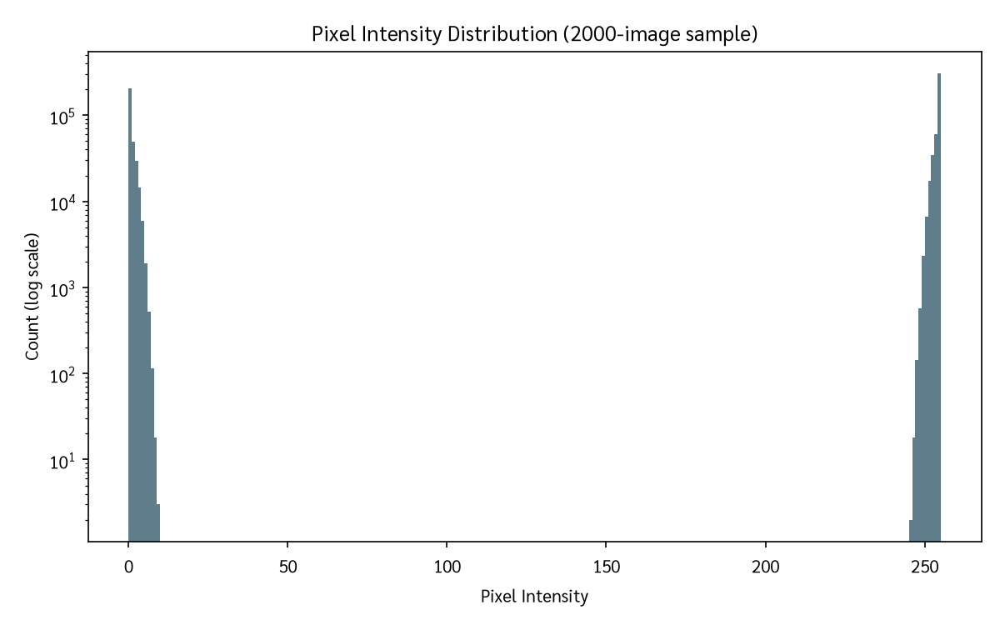

# EDA Report — Thai Character 72-Class Corpus

## Headline Numbers

| Metric | Value |
|--------|-------|
| Total files | 62707 |
| Total OK (loadable) | 62707 |
| Corrupted | 0 |
| Classes | 72 |
| Imbalance ratio (max/min) | 5025.0 |
| Gini coefficient | 0.6716 |
| Top-10 class share | 54.17% |
| Classes with n<50 | 23 |
| Classes with n<10 | 4 |
| Classes with n<5 | 4 |
| Median image size | 16×19 px |
| Overall mid-grey fraction | 0.0 |
| Duplicate MD5 groups | 1174 |
| Redundant files | 2579 |
| Cross-class collisions | 11 |
| Unique after dedup | 60128 |
| "Copy of" files | 6 |
| Distinct groups | 52 |
| Distinct doc IDs | 20 |

## Per-Category Totals

| Category | Count |
|----------|-------|
| consonant | 45177 |
| digit | 282 |
| tone_mark | 2501 |
| vowel | 14747 |

## Full 72-Class Table

| Code | Char | Category | n | Share | Med WxH | Groups | Train/Val |
|------|------|----------|---|-------|---------|--------|-----------|
| 161 | ก | consonant | 1951 | 3.11% | 16×21 | 25 | 1561/390 |
| 162 | ข | consonant | 1355 | 2.16% | 15×20 | 50 | 1084/271 |
| 163 | ฃ | consonant | 1 | 0.00% | 13×15 | 1 | 1/0 |
| 164 | ค | consonant | 1448 | 2.31% | 16×21 | 49 | 1158/290 |
| 167 | ง | consonant | 1078 | 1.72% | 12×18 | 20 | 862/216 |
| 168 | จ | consonant | 1202 | 1.92% | 14×20 | 49 | 962/240 |
| 169 | ฉ | consonant | 43 | 0.07% | 18×20 | 11 | 34/9 |
| 170 | ช | consonant | 1013 | 1.62% | 17×20 | 50 | 810/203 |
| 171 | ซ | consonant | 295 | 0.47% | 20×22 | 39 | 236/59 |
| 173 | ญ | consonant | 113 | 0.18% | 25×21 | 26 | 90/23 |
| 175 | ฏ | consonant | 32 | 0.05% | 16×30 | 7 | 26/6 |
| 176 | ฐ | consonant | 118 | 0.19% | 14×22 | 20 | 94/24 |
| 177 | ฑ | consonant | 1 | 0.00% | 15×13 | 1 | 1/0 |
| 178 | ฒ | consonant | 48 | 0.08% | 22×22 | 13 | 38/10 |
| 179 | ณ | consonant | 292 | 0.47% | 25×21 | 42 | 234/58 |
| 180 | ด | consonant | 2025 | 3.23% | 16×20 | 50 | 1620/405 |
| 181 | ต | consonant | 1662 | 2.65% | 16×20 | 51 | 1330/332 |
| 182 | ถ | consonant | 435 | 0.69% | 16×21 | 45 | 348/87 |
| 183 | ท | consonant | 1745 | 2.78% | 18×20 | 52 | 1396/349 |
| 184 | ธ | consonant | 143 | 0.23% | 18×22 | 30 | 114/29 |
| 185 | น | consonant | 4863 | 7.76% | 19×20 | 52 | 3890/973 |
| 186 | บ | consonant | 1889 | 3.01% | 18×20 | 51 | 1511/378 |
| 187 | ป | consonant | 1133 | 1.81% | 18×30 | 50 | 906/227 |
| 188 | ผ | consonant | 344 | 0.55% | 15×20 | 39 | 275/69 |
| 189 | ฝ | consonant | 39 | 0.06% | 15×29 | 11 | 31/8 |
| 190 | พ | consonant | 729 | 1.16% | 19×21 | 47 | 583/146 |
| 191 | ฟ | consonant | 103 | 0.16% | 19×30 | 20 | 82/21 |
| 192 | ภ | consonant | 239 | 0.38% | 19×23 | 31 | 191/48 |
| 193 | ม | consonant | 3306 | 5.27% | 17×20 | 50 | 2645/661 |
| 194 | ย | consonant | 2197 | 3.50% | 14×20 | 51 | 1758/439 |
| 195 | ร | consonant | 4663 | 7.44% | 13×20 | 51 | 3730/933 |
| 196 | ฤ | consonant | 13 | 0.02% | 20×37 | 3 | 10/3 |
| 197 | ล | consonant | 2187 | 3.49% | 15×20 | 51 | 1750/437 |
| 199 | ว | consonant | 1724 | 2.75% | 13×18 | 51 | 1379/345 |
| 200 | ศ | consonant | 94 | 0.15% | 16×21 | 22 | 75/19 |
| 201 | ษ | consonant | 264 | 0.42% | 19×21 | 36 | 211/53 |
| 202 | ส | consonant | 1595 | 2.54% | 19×22 | 49 | 1276/319 |
| 203 | ห | consonant | 1490 | 2.38% | 19×20 | 49 | 1192/298 |
| 204 | ฬ | consonant | 3 | 0.00% | 22×31 | 1 | 2/1 |
| 205 | อ | consonant | 3272 | 5.22% | 14×19 | 51 | 2618/654 |
| 206 | ฮ | consonant | 10 | 0.02% | 16×20 | 4 | 8/2 |
| 207 | ฯ | consonant | 20 | 0.03% | 13×19 | 5 | 16/4 |
| 209 | ั | vowel | 4120 | 6.57% | 14×8 | 51 | 3296/824 |
| 210 | า | vowel | 5025 | 8.01% | 12×20 | 52 | 4020/1005 |
| 212 | ิ | vowel | 47 | 0.07% | 16×8 | 23 | 38/9 |
| 213 | ี | vowel | 143 | 0.23% | 18×12 | 33 | 114/29 |
| 214 | ึ | vowel | 14 | 0.02% | 14×10 | 5 | 11/3 |
| 215 | ื | vowel | 60 | 0.10% | 18×12 | 15 | 48/12 |
| 216 | ุ | vowel | 155 | 0.25% | 8×13 | 14 | 124/31 |
| 217 | ู | vowel | 139 | 0.22% | 13×10 | 11 | 111/28 |
| 224 | เ | vowel | 203 | 0.32% | 7×18 | 2 | 162/41 |
| 225 | แ | vowel | 21 | 0.03% | 13×17 | 9 | 17/4 |
| 226 | โ | vowel | 699 | 1.11% | 14×33 | 44 | 559/140 |
| 227 | ใ | vowel | 1086 | 1.73% | 15×40 | 48 | 869/217 |
| 228 | ไ | vowel | 725 | 1.16% | 13×32 | 38 | 580/145 |
| 229 | ๅ | vowel | 2310 | 3.68% | 13×27 | 40 | 1848/462 |
| 230 | ๆ | tone_mark | 121 | 0.19% | 16×27 | 33 | 97/24 |
| 231 | ็ | tone_mark | 119 | 0.19% | 14×11 | 11 | 95/24 |
| 232 | ่ | tone_mark | 479 | 0.76% | 4×8 | 10 | 383/96 |
| 233 | ้ | tone_mark | 1007 | 1.61% | 14×12 | 22 | 806/201 |
| 234 | ๊ | tone_mark | 49 | 0.08% | 19×9 | 7 | 39/10 |
| 236 | ์ | tone_mark | 726 | 1.16% | 12×12 | 43 | 581/145 |
| 240 | ๐ | digit | 83 | 0.13% | 15×16 | 27 | 66/17 |
| 241 | ๑ | digit | 46 | 0.07% | 16×15 | 13 | 37/9 |
| 242 | ๒ | digit | 39 | 0.06% | 22×21 | 10 | 31/8 |
| 243 | ๓ | digit | 23 | 0.04% | 20×14 | 10 | 18/5 |
| 244 | ๔ | digit | 16 | 0.03% | 22×23 | 6 | 13/3 |
| 245 | ๕ | digit | 17 | 0.03% | 22×22 | 5 | 14/3 |
| 246 | ๖ | digit | 12 | 0.02% | 18×23 | 6 | 10/2 |
| 247 | ๗ | digit | 4 | 0.01% | 20×21 | 3 | 3/1 |
| 248 | ๘ | digit | 27 | 0.04% | 18×18 | 14 | 22/5 |
| 249 | ๙ | digit | 15 | 0.02% | 16×22 | 5 | 12/3 |

## Imbalance Analysis

The dataset is **highly imbalanced** with an imbalance ratio of **5025.0** (max class
has 5025 files vs min class with 1 files). The Gini coefficient
is 0.6716, confirming significant inequality. The top 10 classes account for 54.17%
of all files. 23 classes have fewer than 50 samples, 4 have fewer than
10, and 4 have fewer than 5.

## Duplicates & Hygiene

- **1174** duplicate MD5 groups found, covering **2579** redundant files.
- **11** cross-class collision groups (same image in different class folders).
- **6** files with "Copy of" prefix detected.
- After deduplication: **60128** unique images.

### Cross-class collision examples

**1.** MD5 `143387a2ed0a2c05c6b748944cd41bf1` — 2 files across classes: ม (193), ั (209)
  - `ThaiCharacter Dataset/round2/193/be_002sg_9_351.jpg`
  - `ThaiCharacter Dataset/round2/209/be_016sg_8_144.jpg`

**2.** MD5 `1a054f26a7414dba57f0514b206fa548` — 2 files across classes: า (210), ๅ (229)
  - `ThaiCharacter Dataset/round2/210/ce_001sg_2_8.jpg`
  - `ThaiCharacter Dataset/round2/229/ce_001sg_2_8.jpg`

**3.** MD5 `269fd74a7c512aac81efac64f38debc3` — 2 files across classes: จ (168), า (210)
  - `ThaiCharacter Dataset/round2/168/bc_008tg_11_168.jpg`
  - `ThaiCharacter Dataset/round2/210/Copy of bc_008tg_11_168.jpg`

**4.** MD5 `2a30394df89f9e1dc761f1bb4c94c8fe` — 2 files across classes: จ (168), า (210)
  - `ThaiCharacter Dataset/round2/168/bc_008tg_11_31.jpg`
  - `ThaiCharacter Dataset/round2/210/Copy of bc_008tg_11_31.jpg`

**5.** MD5 `44b0bda0dd02005b8ef037b08865657e` — 2 files across classes: ค (164), ต (181)
  - `ThaiCharacter Dataset/round2/164/bc_012sg_2_59.jpg`
  - `ThaiCharacter Dataset/round2/181/bc_009sg_2_196.jpg`

## Group Structure

Files are organised by `prefix_docid` groups. There are **52** distinct groups
across **20** unique document IDs.

**Per-prefix counts:**

| Prefix | Files |
|--------|-------|
| bc | 21571 |
| be | 32656 |
| bl | 8317 |
| ce | 163 |

## Figures

- 
- 
- 
- 
- 
