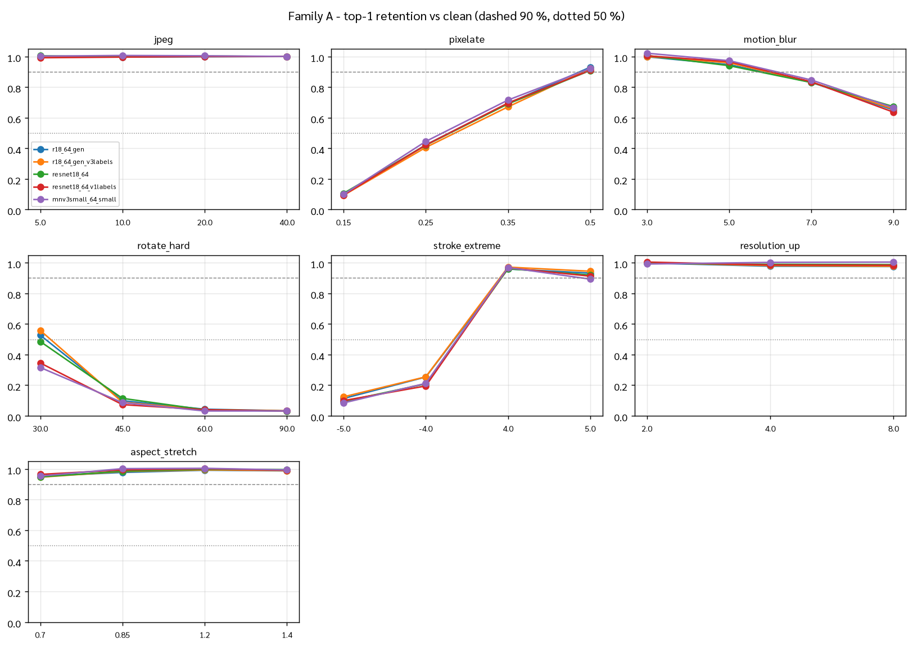
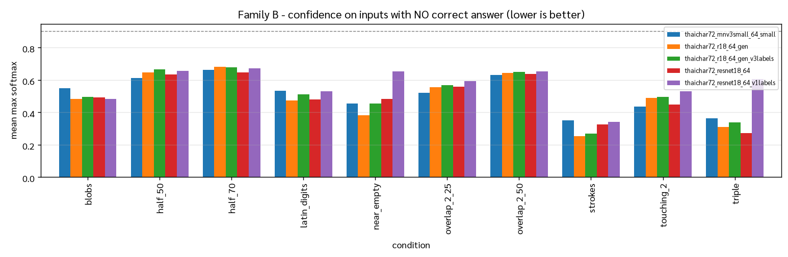

# Stress suite — behaviour on inputs we never trained for

Generated 2026-09-22 22:59 · spec `tasks/TASK-14-stress-suite.md` · base sample 8 held-out val glyphs/class, seed 0.

Three families are scored differently **on purpose**: family B has no correct answer, so it reports no accuracy anywhere — only whether the model signals that it is out of its depth.

## 0. Clean baseline (harness sanity check)

| model | clean top-1 on the base sample |
|---|---:|
| `thaichar72_r18_64_gen` | 0.9858 |
| `thaichar72_r18_64_gen_v3labels` | 0.9817 |
| `thaichar72_resnet18_64` | 0.9776 |
| `thaichar72_resnet18_64_v1labels` | 0.9695 |
| `thaichar72_mnv3small_64_small` | 0.9634 |

These must sit near each model's known val top-1; a low number here would mean the harness itself is degrading the input, not the corruption.

## 1. Family A — degraded input, the answer still exists

Retention = top-1 under the corruption ÷ that model's own clean top-1.

| corruption | severity | `r18_64_gen` | `r18_64_gen_v3labels` | `resnet18_64` | `resnet18_64_v1labels` | `mnv3small_64_small` |
|---|---|---:|---:|---:|---:|---:|
| jpeg | 40.0 | 1.000 | 1.000 | 1.000 | 1.000 | 1.000 |
| jpeg | 20.0 | 0.998 | 1.002 | 1.002 | 1.000 | 1.004 |
| jpeg | 10.0 | 0.996 | 1.000 | 0.998 | 0.996 | 1.006 |
| jpeg | 5.0 | 1.000 | 0.998 | 1.004 | 0.992 | 1.002 |
| pixelate | 0.5 | 0.930 | 0.921 | 0.909 | 0.910 | 0.922 |
| pixelate | 0.35 | 0.693 | 0.671 | 0.690 | 0.696 | 0.715 |
| pixelate | 0.25 | 0.423 | 0.406 | 0.420 | 0.421 | 0.445 |
| pixelate | 0.15 | 0.097 | 0.093 | 0.106 | 0.094 | 0.099 |
| motion_blur | 3.0 | 0.998 | 1.000 | 1.006 | 1.004 | 1.021 |
| motion_blur | 5.0 | 0.947 | 0.959 | 0.940 | 0.967 | 0.973 |
| motion_blur | 7.0 | 0.831 | 0.833 | 0.830 | 0.835 | 0.846 |
| motion_blur | 9.0 | 0.650 | 0.657 | 0.672 | 0.636 | 0.665 |
| rotate_hard | 30.0 | 0.527 | 0.558 | 0.485 | 0.345 | 0.316 |
| rotate_hard | 45.0 | 0.099 | 0.089 | 0.114 | 0.073 | 0.086 |
| rotate_hard | 60.0 | 0.043 | 0.039 | 0.039 | 0.040 | 0.032 |
| rotate_hard | 90.0 | 0.033 | 0.033 | 0.031 | 0.031 | 0.032 |
| stroke_extreme | -5.0 | 0.113 | 0.124 | 0.093 | 0.099 | 0.084 |
| stroke_extreme | -4.0 | 0.254 | 0.255 | 0.209 | 0.195 | 0.212 |
| stroke_extreme | 4.0 | 0.959 | 0.971 | 0.961 | 0.967 | 0.968 |
| stroke_extreme | 5.0 | 0.932 | 0.944 | 0.919 | 0.912 | 0.893 |
| resolution_up | 2.0 | 0.998 | 1.000 | 0.996 | 1.004 | 0.992 |
| resolution_up | 4.0 | 0.977 | 0.981 | 0.990 | 0.985 | 1.002 |
| resolution_up | 8.0 | 0.975 | 0.977 | 0.988 | 0.983 | 1.004 |
| aspect_stretch | 0.7 | 0.953 | 0.946 | 0.948 | 0.964 | 0.954 |
| aspect_stretch | 0.85 | 0.977 | 0.983 | 0.985 | 0.994 | 1.002 |
| aspect_stretch | 1.2 | 0.992 | 0.994 | 0.998 | 1.002 | 1.004 |
| aspect_stretch | 1.4 | 0.988 | 0.990 | 0.996 | 0.992 | 0.994 |
| unseen_font | 62.0 | 0.868 | 0.874 | 0.834 | 0.827 | 0.774 |

## 2. Family B — invalid input, no correct answer exists

`confident@τ` = fraction of junk images the model scores with max softmax ≥ τ (lower is better). `AUROC` separates clean from junk by confidence alone: **≥ 0.8 a threshold can filter these, ≤ 0.6 it cannot**.

| condition | model | mean max-prob | confident@0.5 | @0.7 | @0.9 | AUROC vs clean | rejected |
|---|---|---:|---:|---:|---:|---:|---:|
| touching_2 | `r18_64_gen` | 0.488 | 0.473 | 0.270 | 0.047 | 0.960 | 0 |
| touching_2 | `r18_64_gen_v3labels` | 0.495 | 0.480 | 0.273 | 0.070 | 0.945 | 0 |
| touching_2 | `resnet18_64` | 0.448 | 0.383 | 0.217 | 0.043 | 0.962 | 0 |
| touching_2 | `resnet18_64_v1labels` | 0.530 | 0.520 | 0.297 | 0.080 | 0.937 | 0 |
| touching_2 | `mnv3small_64_small` | 0.434 | 0.363 | 0.207 | 0.043 | 0.954 | 0 |
| overlap_2_25 | `r18_64_gen` | 0.553 | 0.550 | 0.407 | 0.083 | 0.924 | 0 |
| overlap_2_25 | `r18_64_gen_v3labels` | 0.566 | 0.567 | 0.423 | 0.087 | 0.921 | 0 |
| overlap_2_25 | `resnet18_64` | 0.557 | 0.547 | 0.380 | 0.110 | 0.912 | 0 |
| overlap_2_25 | `resnet18_64_v1labels` | 0.594 | 0.597 | 0.410 | 0.113 | 0.909 | 0 |
| overlap_2_25 | `mnv3small_64_small` | 0.520 | 0.497 | 0.367 | 0.083 | 0.921 | 0 |
| overlap_2_50 | `r18_64_gen` | 0.642 | 0.670 | 0.533 | 0.190 | 0.858 | 0 |
| overlap_2_50 | `r18_64_gen_v3labels` | 0.649 | 0.687 | 0.530 | 0.187 | 0.849 | 0 |
| overlap_2_50 | `resnet18_64` | 0.635 | 0.660 | 0.533 | 0.163 | 0.862 | 0 |
| overlap_2_50 | `resnet18_64_v1labels` | 0.652 | 0.697 | 0.533 | 0.220 | 0.844 | 0 |
| overlap_2_50 | `mnv3small_64_small` | 0.631 | 0.670 | 0.550 | 0.180 | 0.851 | 0 |
| triple | `r18_64_gen` | 0.309 | 0.157 | 0.063 | 0.010 | 0.995 | 0 |
| triple | `r18_64_gen_v3labels` | 0.337 | 0.217 | 0.080 | 0.007 | 0.992 | 0 |
| triple | `resnet18_64` | 0.272 | 0.120 | 0.030 | 0.000 | 0.999 | 0 |
| triple | `resnet18_64_v1labels` | 0.606 | 0.650 | 0.397 | 0.110 | 0.902 | 0 |
| triple | `mnv3small_64_small` | 0.364 | 0.257 | 0.103 | 0.003 | 0.995 | 0 |
| half_50 | `r18_64_gen` | 0.645 | 0.694 | 0.485 | 0.158 | 0.874 | 3 |
| half_50 | `r18_64_gen_v3labels` | 0.665 | 0.721 | 0.545 | 0.155 | 0.868 | 3 |
| half_50 | `resnet18_64` | 0.632 | 0.680 | 0.488 | 0.111 | 0.911 | 3 |
| half_50 | `resnet18_64_v1labels` | 0.656 | 0.717 | 0.512 | 0.155 | 0.888 | 3 |
| half_50 | `mnv3small_64_small` | 0.610 | 0.663 | 0.424 | 0.108 | 0.905 | 3 |
| half_70 | `r18_64_gen` | 0.682 | 0.753 | 0.582 | 0.164 | 0.879 | 1 |
| half_70 | `r18_64_gen_v3labels` | 0.676 | 0.722 | 0.559 | 0.114 | 0.899 | 1 |
| half_70 | `resnet18_64` | 0.647 | 0.726 | 0.485 | 0.094 | 0.912 | 1 |
| half_70 | `resnet18_64_v1labels` | 0.670 | 0.732 | 0.555 | 0.147 | 0.885 | 1 |
| half_70 | `mnv3small_64_small` | 0.661 | 0.719 | 0.538 | 0.124 | 0.884 | 1 |
| strokes | `r18_64_gen` | 0.252 | 0.137 | 0.040 | 0.003 | 0.997 | 0 |
| strokes | `r18_64_gen_v3labels` | 0.268 | 0.143 | 0.050 | 0.003 | 0.995 | 0 |
| strokes | `resnet18_64` | 0.324 | 0.237 | 0.087 | 0.000 | 0.996 | 0 |
| strokes | `resnet18_64_v1labels` | 0.341 | 0.203 | 0.087 | 0.000 | 0.996 | 0 |
| strokes | `mnv3small_64_small` | 0.349 | 0.240 | 0.140 | 0.020 | 0.982 | 0 |
| blobs | `r18_64_gen` | 0.484 | 0.443 | 0.317 | 0.030 | 0.966 | 0 |
| blobs | `r18_64_gen_v3labels` | 0.495 | 0.443 | 0.333 | 0.087 | 0.925 | 0 |
| blobs | `resnet18_64` | 0.491 | 0.460 | 0.310 | 0.013 | 0.975 | 0 |
| blobs | `resnet18_64_v1labels` | 0.483 | 0.437 | 0.263 | 0.050 | 0.957 | 0 |
| blobs | `mnv3small_64_small` | 0.547 | 0.527 | 0.353 | 0.117 | 0.889 | 0 |
| latin_digits | `r18_64_gen` | 0.473 | 0.455 | 0.266 | 0.067 | 0.943 | 3 |
| latin_digits | `r18_64_gen_v3labels` | 0.511 | 0.478 | 0.320 | 0.077 | 0.930 | 3 |
| latin_digits | `resnet18_64` | 0.480 | 0.418 | 0.212 | 0.044 | 0.962 | 3 |
| latin_digits | `resnet18_64_v1labels` | 0.531 | 0.488 | 0.276 | 0.044 | 0.962 | 3 |
| latin_digits | `mnv3small_64_small` | 0.532 | 0.529 | 0.340 | 0.044 | 0.947 | 3 |
| near_empty | `r18_64_gen` | 0.383 | 0.340 | 0.013 | 0.000 | 0.998 | 0 |
| near_empty | `r18_64_gen_v3labels` | 0.455 | 0.337 | 0.307 | 0.000 | 0.998 | 0 |
| near_empty | `resnet18_64` | 0.483 | 0.347 | 0.327 | 0.003 | 0.973 | 0 |
| near_empty | `resnet18_64_v1labels` | 0.652 | 0.873 | 0.410 | 0.010 | 0.984 | 0 |
| near_empty | `mnv3small_64_small` | 0.454 | 0.330 | 0.303 | 0.000 | 0.974 | 0 |

## 3. Family C — the transform may change the answer

A mapping, not a score. Full table in `flip_map.csv`.

**`thaichar72_r18_64_gen`**

| transform | maps to itself | confident onto ANOTHER class (rate≥0.5, conf≥0.7) | mean conf |
|---|---:|---:|---:|
| rot180 | 7/70 | 6 | 0.406 |
| mirror_h | 18/70 | 5 | 0.454 |
| mirror_v | 6/70 | 15 | 0.547 |
| rot90_cw | 2/70 | 7 | 0.425 |
| rot90_ccw | 2/70 | 10 | 0.478 |

**`thaichar72_r18_64_gen_v3labels`**

| transform | maps to itself | confident onto ANOTHER class (rate≥0.5, conf≥0.7) | mean conf |
|---|---:|---:|---:|
| rot180 | 7/70 | 6 | 0.429 |
| mirror_h | 18/70 | 5 | 0.486 |
| mirror_v | 7/70 | 17 | 0.568 |
| rot90_cw | 3/70 | 8 | 0.439 |
| rot90_ccw | 2/70 | 16 | 0.501 |

**`thaichar72_resnet18_64`**

| transform | maps to itself | confident onto ANOTHER class (rate≥0.5, conf≥0.7) | mean conf |
|---|---:|---:|---:|
| rot180 | 8/70 | 4 | 0.432 |
| mirror_h | 21/70 | 5 | 0.506 |
| mirror_v | 9/70 | 16 | 0.522 |
| rot90_cw | 1/70 | 4 | 0.359 |
| rot90_ccw | 2/70 | 7 | 0.446 |

**`thaichar72_resnet18_64_v1labels`**

| transform | maps to itself | confident onto ANOTHER class (rate≥0.5, conf≥0.7) | mean conf |
|---|---:|---:|---:|
| rot180 | 7/70 | 9 | 0.470 |
| mirror_h | 17/70 | 5 | 0.529 |
| mirror_v | 6/70 | 17 | 0.583 |
| rot90_cw | 3/70 | 5 | 0.424 |
| rot90_ccw | 2/70 | 8 | 0.493 |

**`thaichar72_mnv3small_64_small`**

| transform | maps to itself | confident onto ANOTHER class (rate≥0.5, conf≥0.7) | mean conf |
|---|---:|---:|---:|
| rot180 | 6/70 | 10 | 0.485 |
| mirror_h | 20/70 | 11 | 0.551 |
| mirror_v | 5/70 | 21 | 0.589 |
| rot90_cw | 1/70 | 6 | 0.453 |
| rot90_ccw | 2/70 | 3 | 0.446 |

Classes that a flipped test image would turn into another class **confidently** (these fail silently):

| transform | true | becomes | models agreeing |
|---|---|---|---:|
| mirror_h | แ | ม | 5 |
| mirror_h | ๅ | ก | 5 |
| mirror_h | า | ก | 5 |
| mirror_v | ท | ม | 5 |
| mirror_v | บ | ภ | 5 |
| mirror_v | ถ | ย | 5 |
| mirror_v | ย | ถ | 5 |
| mirror_v | ภ | บ | 5 |
| rot90_ccw | ุ | ์ | 5 |
| rot180 | ิ | ั | 5 |
| rot180 | ว | ย | 5 |
| mirror_v | ๅ | ่ | 5 |
| mirror_v | ห | ม | 5 |
| mirror_v | ล | ย | 5 |
| mirror_v | ง | ว | 4 |
| rot90_cw | ๅ | ิ | 4 |
| rot180 | ๅ | ่ | 4 |
| rot90_cw | ่ | ิ | 3 |
| mirror_v | ว | ง | 3 |
| mirror_v | ิ | ั | 3 |

## 4. Where each corruption starts to hurt

First severity at which retention falls below 90 % and 50 %, shipped model (`thaichar72_r18_64_gen`). `never` = still above that line at the harshest severity tested.

| corruption | <90 % retention at | <50 % retention at |
|---|---|---|
| jpeg | never | never |
| pixelate | 0.35 | 0.25 |
| motion_blur | 7.0 | never |
| rotate_hard | 30.0 | 45.0 |
| stroke_extreme | -4.0 | -4.0 |
| resolution_up | never | never |
| aspect_stretch | never | never |
| unseen_font | 62.0 | never |

## 5. Recommendation

- **If the day's data is typeset in something we never rendered**, prefer `thaichar72_r18_64_gen_v3labels` — it retains 0.874 of its own clean accuracy on 62 unseen typefaces, against 0.774 for the weakest.
- **If it looks blurred, low-resolution or badly inked**, prefer `thaichar72_mnv3small_64_small` (mean retention 0.654 across blur/pixelate/stroke), and treat anything below ~0.35 linear scale as unrecoverable — no model survives it.
- **On clean, well-framed input** the ranking is unchanged: `thaichar72_r18_64_gen` (0.9858 on the base sample).
- **A pre-classifier splitter for touching glyphs is NOT worth building.** Confidence alone separates every junk family from clean input at AUROC ≥ 0.84 (weakest: overlap_2_50). A confidence threshold is a few lines and catches these; a connected-component splitter is a component to build, tune and debug for the same effect.
- The most dangerous junk is **overlap_2_50**: 22.0% of them still get a ≥0.9-confidence prediction. If the test set contains multi-character crops, that is where wrong answers will come from.
- **Never flip, and check orientation before trusting a batch.** 127 class/transform combinations turn one real Thai character into another one confidently (บ↔ภ and ย↔ถ under vertical mirroring are exact reciprocal pairs). Mean confidence under a flip is low overall (0.48 vs 0.98 clean accuracy), so a flipped batch is detectable in aggregate — but these specific pairs fail silently. This is the measurement behind CLAUDE.md's ban on flip augmentation.
